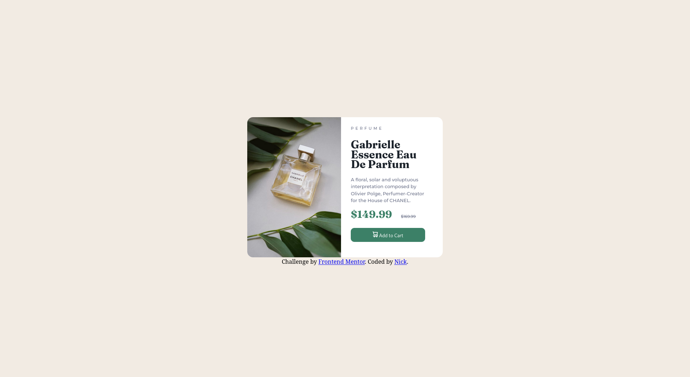

# Frontend Mentor - Product preview card component solution

This is a solution to the [Product preview card component challenge on Frontend Mentor](https://www.frontendmentor.io/challenges/product-preview-card-component-GO7UmttRfa). Frontend Mentor challenges help you improve your coding skills by building realistic projects. 

## Table of contents

- [Overview](#overview)
  - [The challenge](#the-challenge)
  - [Screenshot](#screenshot)
  - [Links](#links)
- [My process](#my-process)
  - [Built with](#built-with)
  - [What I learned](#what-i-learned)
  - [Continued development](#continued-development)
  - [Useful resources](#useful-resources)
- [Author](#author)
- [Acknowledgments](#acknowledgments)

## Overview

### The challenge

Users should be able to:

- View the optimal layout depending on their device's screen size
- See hover and focus states for interactive elements

### Screenshot




### Links

- Solution URL: [Add solution URL here](https://your-solution-url.com)
- Live Site URL: [Add live site URL here](https://your-live-site-url.com)

## My process
My goal for this project was to reduce the amount of unnecessary code being used compared to previous projects. For this design, I used elements of the Skeleton CSS framework to keep the grid CSS minimal. The default Bootstrap framework is over 2000 lines of code, while the code for this project has been reduced to about 150 lines of CSS.

### Built with

- Skeleton CSS Framework
- CSS custom properties
- Flexbox
- CSS Grid

### What I learned
- Utilizing efficient frameworks on a project-by-project basis
- Removing/Reducing redundant code
- Vertically aligning elements on the page
- Creating responsive CSS for desktop/mobile sites

```css
 @media only screen and (min-width: 540px) {
    .mobile-only {
        display:none !important;
    }
} 
@media only screen and (max-width: 541px) {
    .desktop-only {
        display:none !important;
    }
  }
```
```css
/* mobile size*/
@media (min-width: 400px) {
  .container{
max-width: 380px;
  width:85%;
  padding:0; 
}
  .info-box {
    padding:0 5% 0 5%;
      }
}

/*desktop size*/
@media (min-width: 540px) {
  .container {
    position: relative;
    max-width: 640px;}
    .info-box {
      padding:0 5%;
        }
  .column,
  .columns {
    width: 100%;
    float: left;
    box-sizing: border-box; }
    .column:first-child,
    .columns:first-child {
      margin-left: 0; }
    .six.columns                    { width: 48%;            }
    .one-half.column                { width: 48%; }
  
}
```


### Next Goals

- Continue to learn CSS/HTML best practices
- Develop better understanding of flexbox & grid rules
- Continue to develop responsive CSS knowledge


## Author

- Website - [Nick](https://harmonia.codes)
- Frontend Mentor - [@harmoniacodes](https://www.frontendmentor.io/profile/HarmoniaCodes)


## Acknowledgments

Thank you to Frontend Mentor for hosting this challenge.
Thanks as well to @OmarAlSeddik on Frontend Mentor, whose code helped me learn better syntax!

**Note: Delete this note and edit this section's content as necessary. If you completed this challenge by yourself, feel free to delete this section entirely.**
